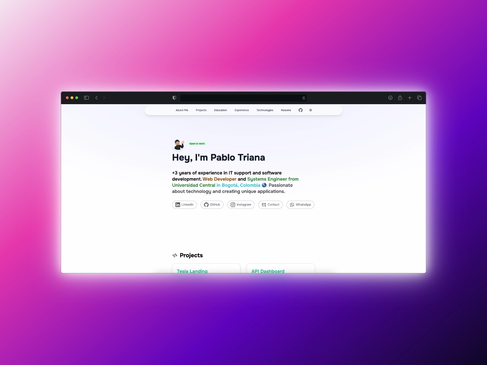

# 🚀 Pablo Triana - Portfolio Personal

[](https://portfolio-dev-plum.vercel.app/)
[](https://astro.build)
[](https://tailwindcss.com)

> Portfolio personal de Pablo Triana - Desarrollador Web e Ingeniero de Sistemas con +3 años de experiencia en soporte IT y desarrollo de software.

## 🌟 Vista Previa



**🔗 [Ver Portfolio en Vivo](https://portfolio-dev-plum.vercel.app/)**

## 📋 Sobre el Proyecto

Este portfolio personal está construido con tecnologías modernas para mostrar mis proyectos, habilidades y experiencia profesional. Diseñado con un enfoque en la performance, accesibilidad y experiencia de usuario.

### ✨ Características Principales

- 🎨 **Diseño Moderno**: Interfaz limpia y profesional
- 🌙 **Modo Oscuro/Claro**: Toggle automático según preferencias del sistema
- 📱 **Totalmente Responsivo**: Optimizado para todos los dispositivos
- ⚡ **Alto Rendimiento**: Construido con Astro para máxima velocidad
- 🎯 **SEO Optimizado**: Meta tags y estructura semántica
- ♿ **Accesible**: Cumple con estándares de accesibilidad web
- 🎭 **Animaciones Suaves**: Transiciones y efectos visuales elegantes

## 🛠️ Tecnologías Utilizadas

### Frontend
- **[Astro](https://astro.build)** - Framework principal
- **[Tailwind CSS](https://tailwindcss.com)** - Framework de CSS
- **[TypeScript](https://www.typescriptlang.org)** - Tipado estático
- **[Swiper](https://swiperjs.com)** - Carrusel de tecnologías

### Herramientas y Deployment
- **[Vercel](https://vercel.com)** - Hosting y deployment
- **[Git](https://git-scm.com)** - Control de versiones
- **[VS Code](https://code.visualstudio.com)** - Editor de código

## 📁 Estructura del Proyecto

Inside of your Astro project, you'll see the following folders and files:

```text
/
├── public/
│   └── favicon.svg
├── src/
│   ├── components/
│   │   └── Card.astro
│   ├── layouts/
│   │   └── Layout.astro
│   └── pages/
│       └── index.astro
└── package.json
```

Astro looks for `.astro` or `.md` files in the `src/pages/` directory. Each page is exposed as a route based on its file name.

There's nothing special about `src/components/`, but that's where we like to put any Astro/React/Vue/Svelte/Preact components.

Any static assets, like images, can be placed in the `public/` directory.

## 🧞 Commands

All commands are run from the root of the project, from a terminal:

| Command                   | Action                                           |
| :------------------------ | :----------------------------------------------- |
| `npm install`             | Installs dependencies                            |
| `npm run dev`             | Starts local dev server at `localhost:4321`      |
| `npm run build`           | Build your production site to `./dist/`          |
| `npm run preview`         | Preview your build locally, before deploying     |
| `npm run astro ...`       | Run CLI commands like `astro add`, `astro check` |
| `npm run astro -- --help` | Get help using the Astro CLI                     |

## 👀 Want to learn more?

Feel free to check [our documentation](https://docs.astro.build) or jump into our [Discord server](https://astro.build/chat).
